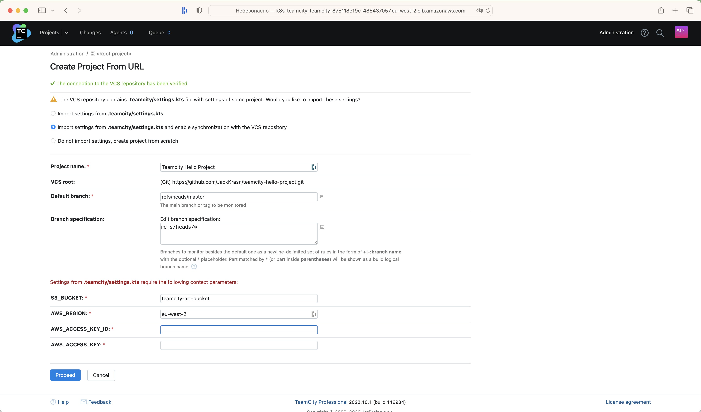

# teamcity-hello-project

This is a test project that uses the infrastructure created in [project](https://github.com/JackKrasn/aws-teamcity-infra).

## Create Test Project

Push "Create Project"

Select "From a repository URL" and set "Repository URL" https://github.com/JackKrasn/teamcity-hello-project.git

After that Click "Proceed"

Don't change anything.

Click "Proceed"

Set the following context parameters:

* S3_BUCKET - the S3 bucket name for artifact storage
* AWS_REGION - the aws region
* AWS_ACCESS_KEY_ID - the aws key id for access s3 storage
* AWS_ACCESS_KEY - the aws key for access s3 storage

After setting context parameter click "Proceed".

That’s it! We should now be able to see the "Teamcity Hello Project" and a build configuration "Hello World".

Click "Run Build"

After successfully building you be able to see Artifact is located in the s3 storage.

